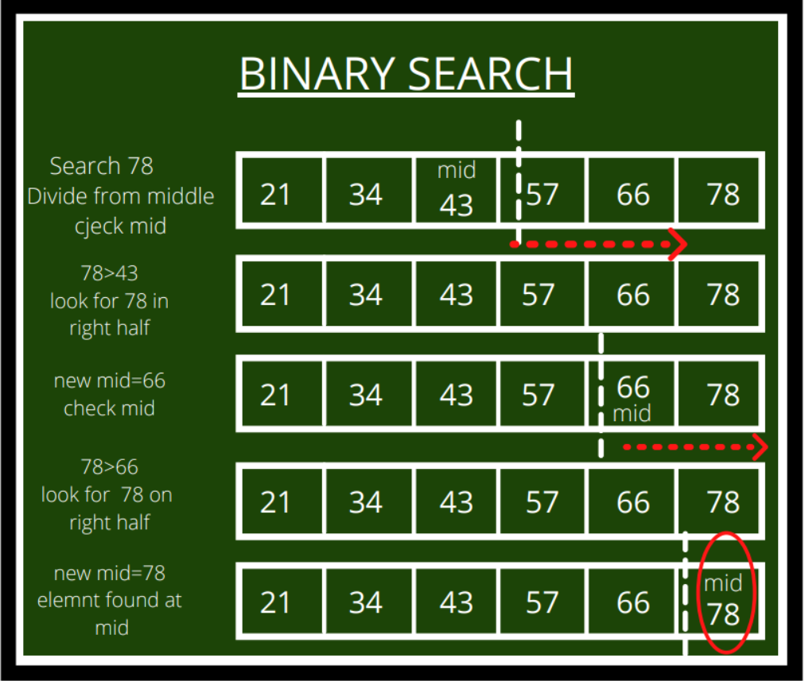

## LeetCode Challenge75 - @Ricardo Ferreira
The only way to keep your game at a very high level
is being challenged every day. Nice source of coding challenges at https://leetcode.com
Let's dive into it!
## _Tools_
- Java 17
- IntelliJ Community Edition

## _Table of contents_
- [LeetCode Challenge75 - @Ricardo Ferreira](#leetcode-challenge75---ricardo-ferreira)
- [_Tools_](#tools)
- [_Table of contents_](#table-of-contents)
- [_Screenshot_](#screenshot)
- [_Links_](#links)
- [_Built with_](#built-with)
- [_What I practiced_](#what-i-practiced)
- [_Continued development_](#continued-development)
  - [_Useful resources_](#useful-resources)
- [_Author_](#author)
- [Acknowledgments](#acknowledgments)


## _Screenshot_
[]()
## _Links_
- Live Site URL: [https://leetcode.com/u/rferreira_757/] 
## _Built with_

 |  |  |  | 

 ## _What I practiced_
```java
package br.dev.ferreiras.dsa.search;

  public int binarySearch(List<Integer> list, int target) {
    int left = 0, right = 0, middle = 0;
    right = list.size() - 1;
    while (left <= right) {
      middle = left + (right - left) / 2;
      if (list.get(middle) == target) {
        return middle;
      }
      if (list.get(middle) < target) {
        left = middle + 1;
      } else {
        right = middle - 1;
      }
    }
    return -1;
  }

``` 

## _Continued development_
- Next step: Hackerrank challenges.
- 
### _Useful resources_
- [https://docs.oracle.com/en/java/] Always trust and read the official documentation!
- [https://cp-algorithms.com/]  A must stop by to tackle DSA...
## _Author_
- Website - [https://www.ferreiras.dev.br]  
## Acknowledgments
